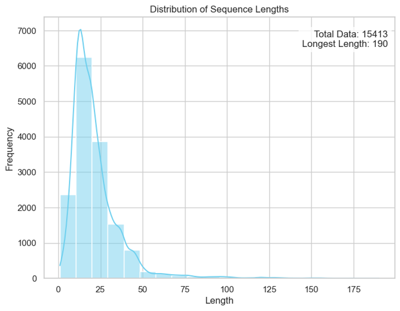
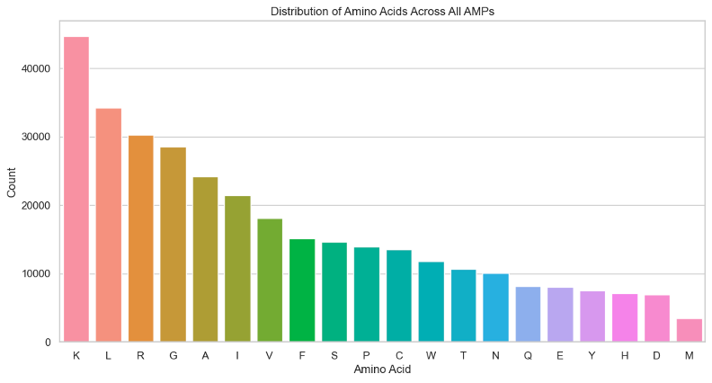
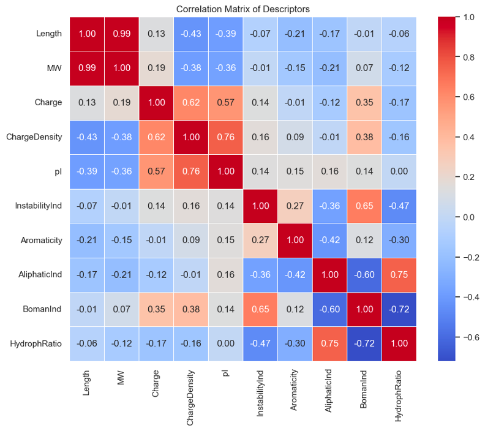

# Antimicrobial Peptides Sequence Data Analysis

This repository provides a comprehensive workflow for analyzing antimicrobial peptide (AMP) sequences using Python. The notebook includes steps for data acquisition, preprocessing, feature extraction, visualization, clustering, and basic classification modeling.

## Overview

Antimicrobial peptides (AMPs) are key components in the defense mechanisms of organisms. This project aims to analyze AMP sequences downloaded from public databases and apply various computational techniques to explore their properties.

## Data Sources

The datasets used in this analysis are in FASTA format, downloaded from:

- [APD3: Antimicrobial Peptide Database](https://aps.unmc.edu/AP/)
- [DBAASP: Database of Antimicrobial Activity and Structure of Peptides](https://dbaasp.org/home)

## Features

- **FASTA Parsing:** Converts peptide FASTA files into structured DataFrames.
- **Feature Extraction:** Computes global physicochemical descriptors using [modlamp](https://github.com/sklgobbler/modlamp).
- **Visualization:** Heatmaps and pairplots for exploring peptide properties.
- **Clustering:** K-means clustering for peptide grouping.
- **Classification:** Logistic regression with metrics evaluation (accuracy, precision, recall, confusion matrix).

## Visualizations

The notebook generates the following visualizations:

1. **Histogram of Sequence Lengths:** Shows a skewed distribution, with most peptides under 40 residues.
2. **Boxplot & Violin Plot:** Provide summary statistics and density estimation of peptide lengths.
3. **Amino Acid Composition:** Displays the frequency of each amino acid across the AMP dataset.
4. **Correlation Matrix:** Reveals relationships between descriptors such as charge, molecular weight, and hydrophobicity.
5. **Library Comparison Charts:** Includes global descriptors across two peptide libraries (charge, hydrophobicity, etc.)

## Requirements

Install dependencies using:

```bash
pip install pandas biopython modlamp seaborn scikit-learn matplotlib
```

## How to Use

1. Clone this repository and open the notebook:

```bash
git clone https://github.com/LinTzuTang/AMP_fasta_analysis.git
jupyter notebook "Antimicrobial Peptides Sequence Data Analysis.ipynb"
```

2. Place the downloaded `APD3.fasta` and `DBAASP.fasta` in the same directory.
3. Run all cells to process the data and visualize the results.

## Output

- Descriptive statistics and plots of peptide properties.
- Cluster assignments for AMP sequences.
- Performance metrics of a logistic regression classifier.

## Author

**Tzutang Lin**

This notebook was developed for academic and research purposes.

## Report Document

A comprehensive Word report is included in this repository:

📄 [**AMP_Sequence_Data_Analysis_Visual_Report.pdf**](./AMP_Sequence_Data_Analysis_Visual_Report.pdf)
This document summarizes key analysis results and visualizations, including:

- Distribution plots of sequence lengths
- Amino acid composition bar chart
- Correlation matrix of descriptors
- Comparative analysis across peptide libraries




